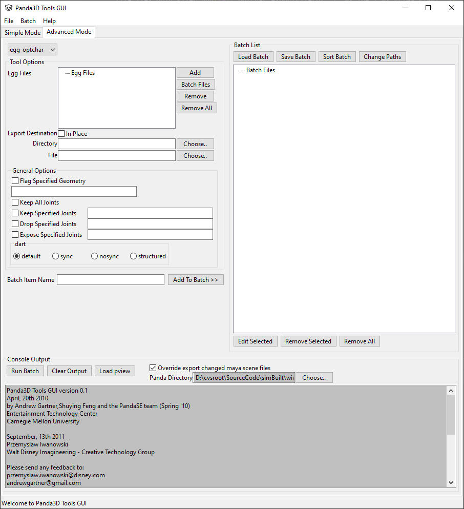
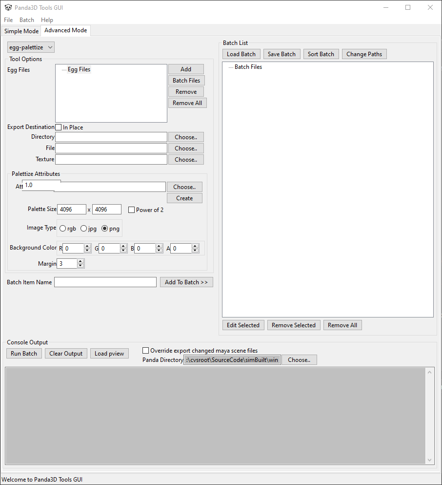
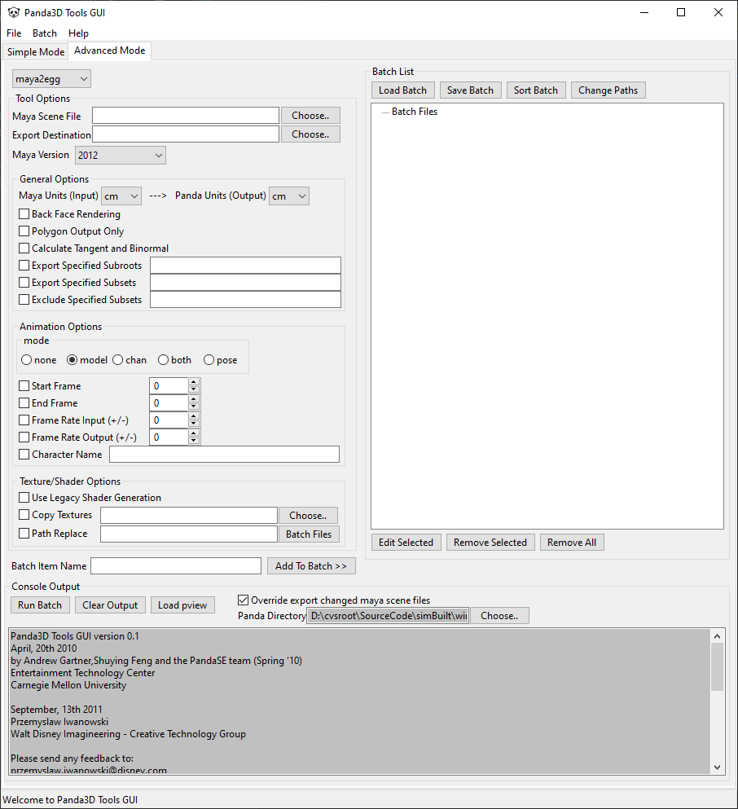

# Panda3D Tools GUI

## Preview

## History
- Version 0.1 created on April 20th, 2010 by Andrew Gartner, Shuying Feng, and the PandaSE team (Spring 2010) at ETC @ CMU
- Contributions made on September, 13th 2011 by Przemyslaw Iwanowski; Walt Disney Imagineering - Creative Technology Group
